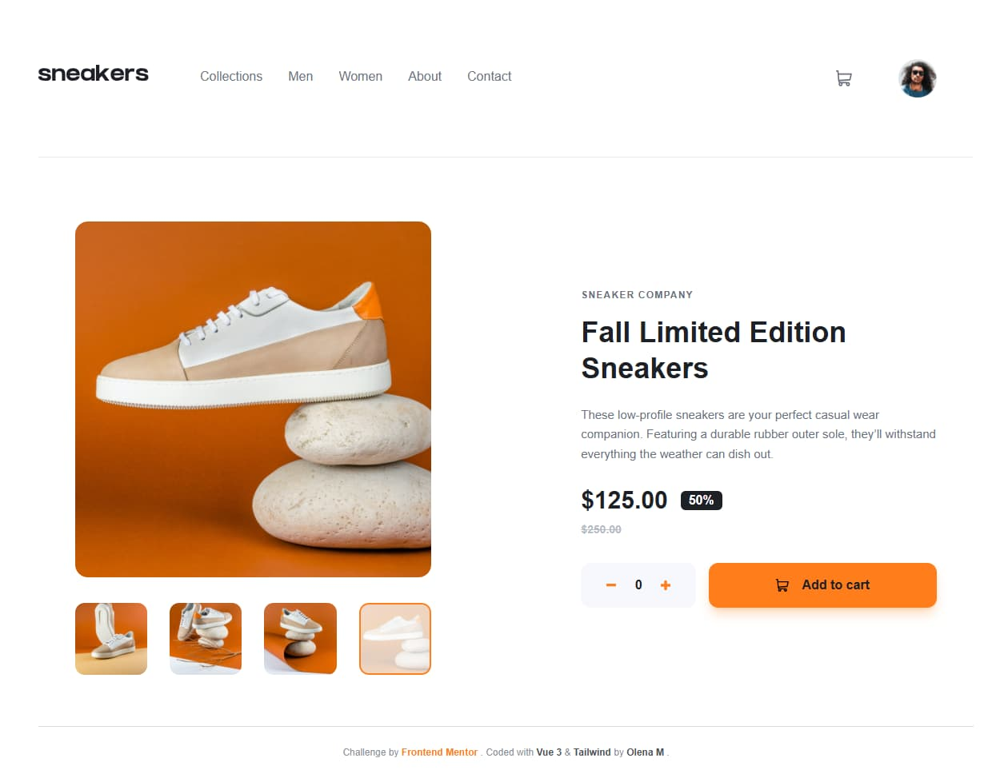
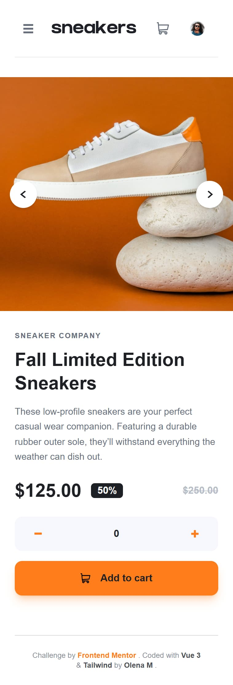

# Frontend Mentor - E-commerce Product Page Solution

This is a fully accessible and responsive solution to the [E-commerce product page challenge on Frontend Mentor](https://frontendmentor.io). Built from scratch using modern frontend standards with Vue 3, Vite and Tailwind.

## Live Demo

[View Live Site](https://ecommerce-product-page-five-zeta.vercel.app/)

## Tech Stack

- **Vue 3** (Composition API, `<script setup>`)
- **Tailwind CSS v4** (Modern utility-first framework with native modern themes)
- **Pinia** (Intuitve global reactive state management)
- **Vite** (Next-generation lightning-fast frontend tooling)
- **VueUse** (`@vueuse/core` and `@vueuse/integrations` for custom event handlers)

## Key Features & Architecture

### High-Standard Accessibility (a11y)

- **Keyboard Navigation:** Full support for `Tab` sequential focus navigation. Focus outlines are visible only for keyboard users via Tailwind's `focus-visible` utility.
- **Dynamic Live Regions:** Implemented `aria-live="polite"` inside the shopping cart. Screen readers automatically announce the state change when items are removed.
- **Semantic ARIA Labels:** Dynamic `:aria-label` string interpolation reflects real-time product quantities for visually impaired users.
- **Focus Traps & Event Closures:** Mobile slide-out menu and desktop gallery Lightbox loop focus internally using modern techniques. Supports dismissal via the `Esc` key.

### Smart Component Architecture & DRY

- **Reusable Gallery Module:** The main slider and the desktop overlay Lightbox share the exact same `ProductGallery.vue` file. Layout behavior switches gracefully via Vue Props.
- **State Separation:** Fine-grained code structure. Extracted business components into isolated atomic modules (`BaseQuantitySelector`, `TheCartDropdown`, `TheFooter`) to keep `App.vue` clean.
- **Global State Management:** Orchestrated shopping cart sync between product data, action buttons, header badges, and dropdown list recalculations via Pinia store.

## Project Structure

```plaintext
ecommerce-product-page
├── public
│   ├── screenshots
│   └── favicon.png
├── src
│   ├── assets
│   │   ├── icons
│   │   ├── images
│   │   └── main.css
│   ├── components
│   │   ├── BaseQuantitySelector.vue
│   │   ├── ProductDetails.vue
│   │   ├── ProductGallery.vue
│   │   ├── ProductLightbox.vue
│   │   ├── TheCartDropdown.vue
│   │   ├── TheFooter.vue
│   │   └── TheHeader.vue
│   ├── stores
│   │   └── cart.js
│   ├── App.vue
│   └── main.js
├── README.md
├── index.html
├── jsconfig.json
├── package-lock.json
├── package.json
└── vite.config.js
```

## Interface Screenshots

|                                                  Desktop Version                                                   |                                                 Mobile Version                                                  |
| :----------------------------------------------------------------------------------------------------------------: | :-------------------------------------------------------------------------------------------------------------: |
| [](./public/screenshots/ecom-pp-desktop.jpg) | [](./public/screenshots/ecom-pp-mobile.jpg) |

## Local Installation & Setup

1. **Clone the repository:**

   ```bash
   git clone https://github.com/LenaM777/ecommerce-product-page
   cd ecommerce-product-page
   ```

2. **Install dependencies:**

   ```bash
   npm install
   ```

3. **Run development server:**

   ```bash
   npm run dev
   ```

4. **Build for production:**
   ```bash
   npm run build
   ```

## 📝 Frontend Mentor Challenge Requirements Completed

- [x] View the optimal layout for the site depending on their device's screen size
- [x] See hover states for all interactive elements on the page
- [x] Open a lightbox gallery by clicking on the large product image (Desktop only)
- [x] Switch the large product image by clicking on the small thumbnail images
- [x] Add items to the cart
- [x] View the cart and remove items from it
